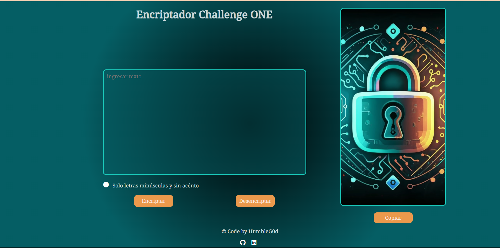

## Encriptador y Desencriptador
    Hola! esta es mi solución al primer challenge propuesto en ONE (Oracle Next Education). La aplicación en cuestión te permite encriptar y desencriptar mensajes utilizando reglas específicas.

## Reglas Predefinidas
    El Encriptador y Desencriptador utiliza las siguientes reglas predefinidas para encriptar y desencriptar mensajes:

    - La letra "e" es convertida a "enter"
    - La letra "i" es convertida a "imes"
    - La letra "a" es convertida a "ai"
    - La letra "o" es convertida a "ober"
    - La letra "u" es convertida a "ufat"
## Características
    - Encripta mensajes según reglas predefinidas.
    - Desencripta mensajes encriptados utilizando las mismas reglas.

## Tecnologías Utilizadas
    - HTML5
    - CSS3 (sin preprocesadores)
    - JavaScript

## Diseño

